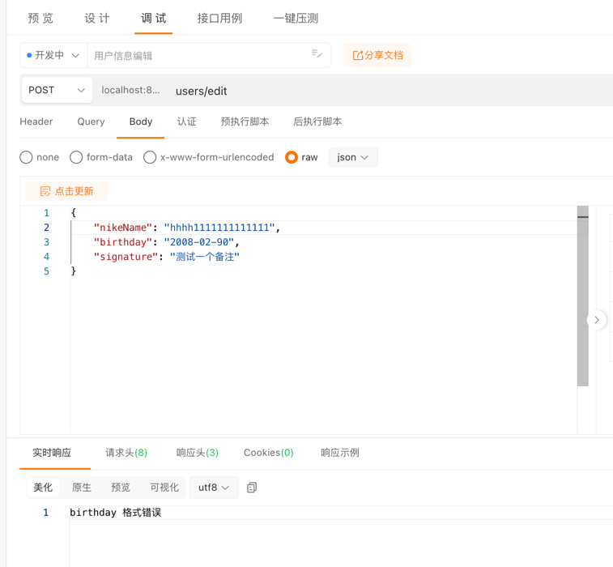

# 第二次作业
```sql
-- 初始化语句
CREATE TABLE `users` (
  `id` bigint NOT NULL AUTO_INCREMENT,
  `email` varchar(191) COLLATE utf8mb4_general_ci DEFAULT NULL,
  `password` longtext COLLATE utf8mb4_general_ci,
  `ctime` bigint DEFAULT NULL,
  `utime` bigint DEFAULT NULL,
  PRIMARY KEY (`id`),
  UNIQUE KEY `email` (`email`)
);

-- 新增语句
alter table users
    add nike_name VARCHAR(32) null after password,
    add birthday VARCHAR(16) null after nike_name,
    add signature VARCHAR(512) null after birthday;
```
- 用户编辑 users/edit





- 用户详情 users/profile


# 第三次作业 修改已有的部署方案


